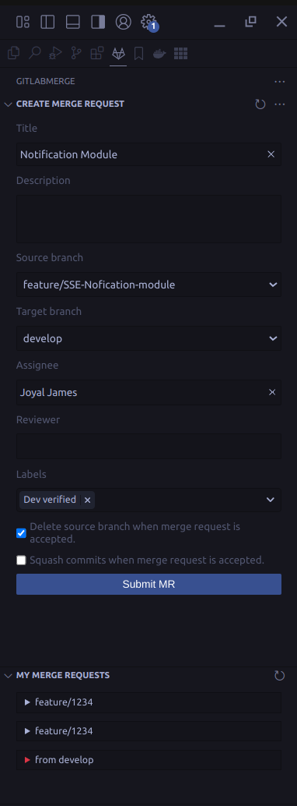

# GitLabMerge+ README

Gitlab Merge Request Helper fo VS Code.

Author: [Joyal James]



## Features

+ Create an Merge Requests from VS Code

## Extension Settings

+ `gitlabmergeplus.token`: Access token to use to connect to the Gitlab.com API. Create one by going to Profile Settings -> Access Tokens.

+ `gitlabmergeplus.instanceUrl`: If you are using GitLab on a custom domain, you must add this to your user settings file.

VS Code settings:


settings.json:

```json
{
    "gitlabmergeplus.token": "xxx",
    "gitlabmergeplus.instanceUrl": "https://git.xxx.com"
}
```

### Links

+ Visual Studio Marketplace: []()
* Github Repo: []()
